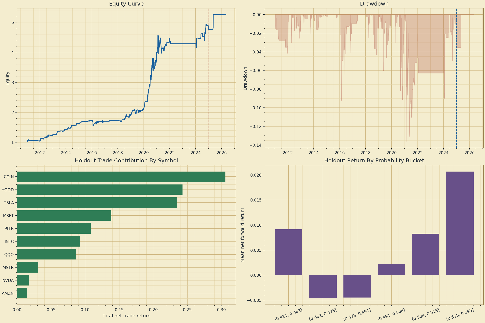
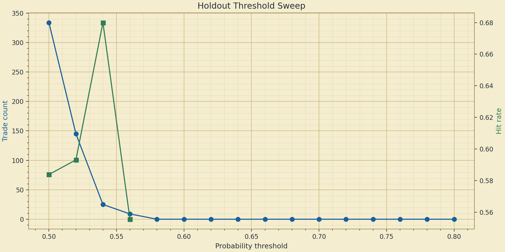
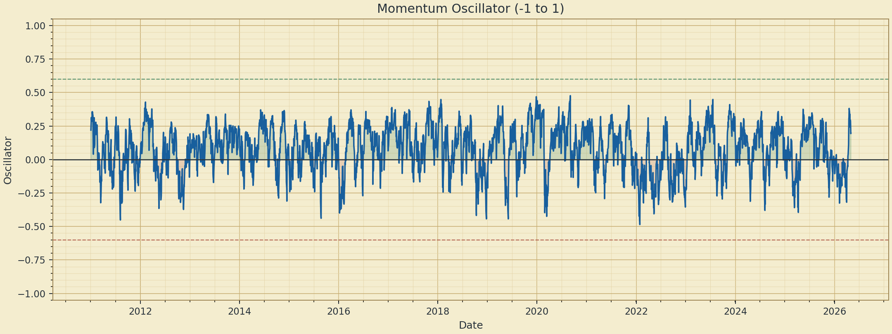
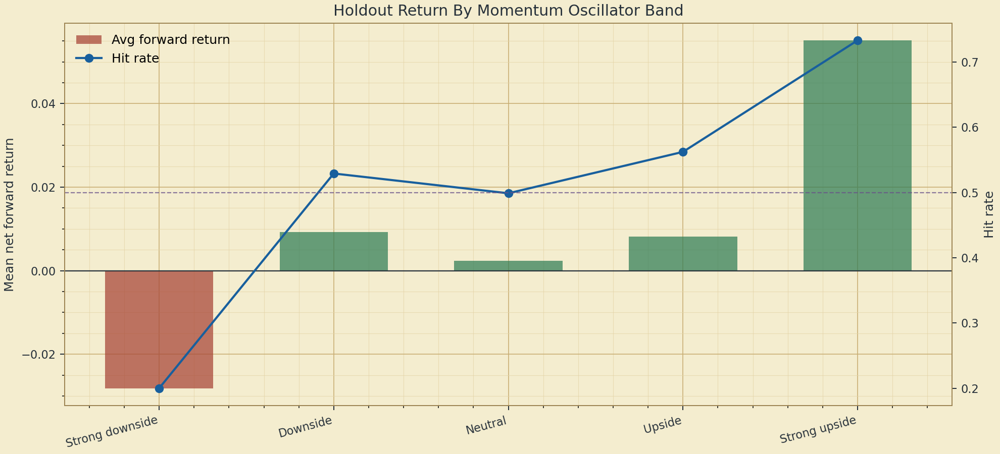

# Results Report

Mode: panel

## Key metrics

- ROC AUC: 0.5438683832406997
- Holdout ROC AUC: 0.5627383491224965
- Holdout total return: 0.31122882984550015
- Holdout Sharpe: 1.2207797327615661
- Holdout max drawdown: -0.002123013469624291
- Holdout trade count: 19

## Key observations

- Pooled panel holdout ROC AUC is 0.563, which is above chance but still moderate.
- The holdout only fired 19 trades across 12 symbols, so the current threshold behaves like a selective filter, not a broad forecaster.
- Headline holdout return is 31.1%, but that is under a simplified equal-weight active-signal aggregation and still needs portfolio-level risk caps before it is deployable.
- In the holdout threshold sweep, the best ex-post Sharpe occurred near threshold 0.54, which is a clue for calibration review rather than a parameter to hard-fit immediately.
- The bounded momentum oscillator research uses 3,984 holdout rows; its return correlation is 0.012 and its model-probability correlation is 0.210.

## Charts

## Momentum oscillator research

The oscillator is an RSI-style bounded momentum feature mapped to `-1..1`, where negative values mean downside momentum, zero is neutral, and positive values mean upside momentum.

Sample: holdout, rows: 3,984.

| Oscillator band | Rows | Avg osc | Hit rate | Avg forward return | Trade rate | Avg probability |
| --- | ---: | ---: | ---: | ---: | ---: | ---: |
| Strong downside | 5 | -0.67 | 20.0% | -2.82% | 0.0% | 0.505 |
| Downside | 633 | -0.31 | 52.9% | 0.93% | 0.0% | 0.485 |
| Neutral | 2,257 | -0.01 | 49.9% | 0.24% | 0.6% | 0.489 |
| Upside | 1,074 | 0.35 | 56.2% | 0.82% | 0.5% | 0.500 |
| Strong upside | 15 | 0.64 | 73.3% | 5.52% | 0.0% | 0.475 |

- Return correlation: 0.012
- Model-probability correlation: 0.210

